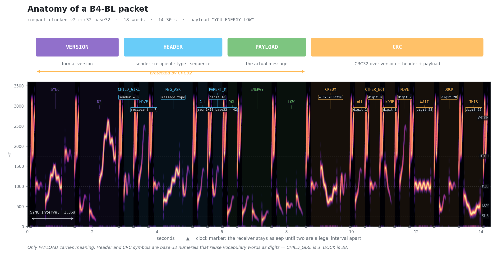

# B4-BL ("Babble")

**A constructed language for robots, that humans can learn by ear.**

Astromech droids in Star Wars have a wonderful property: they beep and whistle at
each other, and over time you start to *get it*. Not the exact words — the mood, the
urgency, whether things are going well. R2-D2 never speaks English, and you always
know when he's annoyed.

B4-BL is a real, working version of that. It is a low-bandwidth acoustic side channel
for machines that share physical space — and it is designed so that a human who lives
around those machines gradually learns roughly what is going on, without ever being
taught.

## Hear it

The same sentence — *"Is your energy low?"* — rendered in four emotional registers.
The words are identical. Only the prosody changes.

| | |
|---|---|
| [`prosody_neutral.wav`](audio_samples/prosody_neutral.wav) | flat, informational |
| [`prosody_uncertain.wav`](audio_samples/prosody_uncertain.wav) | hedging, rising |
| [`prosody_urgent.wav`](audio_samples/prosody_urgent.wav) | fast, compressed, insistent |
| [`prosody_calm.wav`](audio_samples/prosody_calm.wav) | slow, settled |

*(GitHub won't play audio inline — download, or listen on the [demo page](#demo).)*

Also worth a listen: [`phoneme_inventory.wav`](audio_samples/phoneme_inventory.wav)
(every sound in the language, in a row) and
[`sentences_neutral.wav`](audio_samples/sentences_neutral.wav) (example messages).

## What this actually is

Two acoustic layers travel at the same time, in the same sound:

- a **symbolic layer** — sparse, robust, exactly machine-decodable;
- an **expressive layer** — prosody and affect that a human reads intuitively and a
  machine is free to ignore.

That split is the whole design. A droid recovers the *exact packet*, CRC-checked, or
rejects it. A human standing nearby doesn't decode anything — they pick up tone the
same way you pick up that someone two rooms away is frustrated, without hearing words.

Three layers of structure sit under that:

| Layer | What it defines |
|---|---|
| **Phonology** | ~32 acoustic primitives — the "sounds" |
| **Lexicon** | 215 morphemes built from those primitives, plus grammar and spelling |
| **Prosody** | affect, as transforms applied on top — never lexical |

On top of the language sits a **transport**: CRC32-protected packets with versioning,
addressing, and sequence numbers, so two machines can exchange data rather than just
vibes.

## Anatomy of a packet

<picture>
  <source media="(prefers-color-scheme: dark)" srcset="docs/img/packet-annotated.png">
  
</picture>

A complete addressed, checksummed packet carrying the three-word payload
`YOU ENERGY LOW` is 18 words and 14.3 seconds of audio:

```
SYNC D2 │ CHILD_GIRL MOVE MSG_ASK ALL PARENT_M │ YOU ENERGY LOW │ CKSUM ALL OTHER_BOT NONE MOVE WAIT DOCK THIS
└ version ┘ └──────────── header ─────────────┘  └── payload ──┘  └──────────────── CRC32 ─────────────────┘
```

**Only the payload carries meaning.** Everything else is numbers.

Metadata is encoded in **base 32**, and the 32 digits of that alphabet are ordinary
vocabulary words reused as numerals. So in the header above:

| Sounds like | Actually means |
|---|---|
| `CHILD_GIRL` | sender = **3** (digit 3 in the base-32 alphabet) |
| `MOVE` | recipient = **7** |
| `MSG_ASK` | message type — *this one is literal* |
| `ALL` `PARENT_M` | sequence = **42** (digits 1 and 10 → 1×32 + 10) |
| `ALL OTHER_BOT NONE MOVE WAIT DOCK THIS` | CRC = **0x5283df96** |

Read as words, the header is nonsense. Read as digits, it says *"droid 3 asks droid 7,
message #42: is your energy low?"*

Reusing vocabulary as numerals keeps the transport inside the existing sound inventory
instead of inventing new noises for protocol overhead. That matters because every new
sound is another thing the decoder can confuse.

The format supports 32 local addresses and 1,024 sequence values. CRC32 covers the
version, the complete header, and the payload — but not the CRC symbols themselves.

## How the language is built

### The sounds

Every phoneme is a point in a four-dimensional space. Fully compositional — no
arbitrary sound inventory to memorize.

| Dimension | Values | |
|---|---|---|
| **Band** | `SUB` 260 Hz · `LOW` 520 · `MID` 1000 · `HIGH` 1750 · `VHIGH` 2700 | lexical |
| **Contour** | flat · rise · fall · arch · dip · scoop · double | lexical |
| **Duration** | short (160 ms) · long (500 ms) | lexical |
| **Sound class** | tone · gargle · rasp | lexical |
| **Prosody** | neutral · uncertain · urgent · calm | **expressive — the decoder ignores it** |

That last row is the thesis. Prosody changes what a *human* hears and is deliberately
invisible to the symbol decoder, which is why the four files above decode identically.

Not every combination is used — the inventory is the 32 that survived listening tests.

### The vocabulary

215 morphemes across 11 categories. A sample, not the dictionary:

| Category | Count | Examples |
|---|---:|---|
| `verb` | 45 | `MOVE` `STOP` `FOLLOW` `COME` `GO` `BRING` `TAKE` |
| `spatial` | 30 | `FRONT` `BACK` `LEFT` `RIGHT` `UP` `DOWN` |
| `object` | 30 | `OBJECT` `TOOL` `DOOR` `PERSON` `CHARGER` `CONTAINER` |
| `state` | 29 | `ENERGY` `LOW` `HIGH` `OK` `FAULT` `BUSY` |
| `pronoun` | 14 | `SELF` `YOU` `IT` `THIS` `THAT` |
| `logic` · `time` · `quantity` | 29 | `AND` `NOT` `IF` · `NOW` `SOON` · `MORE` `FEW` |
| `social` | 6 | `GREETING` `FAREWELL` `THANKS` `PLEASE` `SORRY` |
| `digit` · `protocol` | 19 | `D0`–`D9` · `SYNC` `ADDR` `CKSUM` |

Anything outside the dictionary can be **spelled** — a marker phoneme switches into a
two-phoneme-per-character mode covering `a–z0–9`.

### Words are built from sounds by frequency

Common words get short codes. Rare words get longer ones. Multi-phoneme codes are
assigned with a minimum Hamming distance of 2, so a single misheard phoneme can't
silently turn one word into another.

| Concept | Phonemes | |
|---|---|---|
| `STOP` | `Hd` | high, falling, short |
| `GO` | `Sf` | sub-bass, flat |
| `SELF` | `Lf` | low, flat |
| `YOU` | `Lr` | low, **rising** — same band as `SELF`, opposite contour |
| `WARN` | `Hr Hr` | high rising, doubled |
| `ENERGY` | `Lr Sd Sr` | three phonemes — a rarer word |

25 concepts are single-phoneme, 27 are two, and the bulk are three.

### End to end

> **"Is your energy low?"**
> → `QUERY YOU ENERGY LOW`
> → `Hr Mr` · `Lr` · `Lr Sd Sr` · `Ld Lf Ld`
> → 2.0 seconds of audio

## Try it

```bash
pip install -r requirements.txt
python3 src/demo_language.py     # renders sentences, prosody, inventory to audio_samples/
python3 -m pytest -q             # round-trip + unambiguity tests
```

## Demo

<!-- TODO: link to GitHub Pages demo once published -->

A browser demo lets you compose a sentence from the real grammar and hear it
synthesized live. *(In progress.)*

## Design notes

Phase 0 was a listening study, and it settled the sound direction before any decoder
work began:

- **Pure tone reads as R2.** Adding harmonics or ring modulation reads as "kazoo" or
  "SNES sound effect." The character lives in the **pitch gesture**, not the timbre.
- Sample-and-hold random burble reads as low-budget sci-fi. Dropped.
- Grit is per-family — wrong on whistles, right on raspberries.

Full findings are in the project design docs. The open question, documented as a
reviewed proposal in [`b4bl/phonology.py`](b4bl/phonology.py): exactly which acoustic
dimensions are lexical versus expressive.

## Layout

```
b4bl/
  generators.py        the locked Phase 0 sound palette (tonal + rough families)
  phonology.py         Layer 1: acoustic primitive inventory (the "phonemes")
  lexicon.py           Layer 2: morpheme vocabulary + grammar + spelling fallback
  prosody.py           Layer 3: affect as transforms on expressive dimensions
  codec.py             meaning <-> phoneme-sequence <-> audio
  compact_clocked.py   CRC32-protected packet transport
  runtime_receiver.py  streaming wake, level normalization, decode + reply policy
src/
  demo_language.py     renders sentences + prosody + inventory to audio
  listen_runtime.py    desktop microphone event/reply harness
  replay_runtime.py    silent chunked receiver replay + metrics
  ambient_benchmark.py reproducible interference benchmark
tests/                 symbolic round-trip + inventory sanity tests
audio_samples/         rendered demos (WAV/MP3)
```

---

<details>
<summary><strong>But will this actually be intelligible to other droids?</strong> &nbsp;<em>(a lot of validation detail lives in here)</em></summary>

<br>

Short answer: **yes, in measured conditions, with zero wrong packets ever accepted** —
and the qualifier matters enough that the long answer is long.

This section is a research log, not a sales pitch. It includes the runs that failed.

### Headline results

Every number below comes from a **prospective** run: the model and decoder settings
were frozen before the data was collected or evaluated.

| Condition | Verified delivery | Wrong packets |
|---|---:|---:|
| Quiet room (room 5), 500 packets | 95.8% (479/500) | 0 |
| Clean AUKEY mic / Bluetooth speaker, 200 packets | 95.0% (190/200) | 0 |
| Room with continuous music, 200 packets | 96.0% (192/200) | 0 |
| Digital ambient mixtures ≥ +24 dB SNR, 64 cases | 98.4% (63/64) | 0 |

**No run, in any condition, has ever accepted a wrong packet.** When the channel is
too degraded, the receiver rejects. It fails closed.

The music-validation run is the strongest single result: 192/200 exact (96.0%, exact
95% interval 92.27–98.26%), all 200 raw recordings present, music present throughout
at a median −38.16 dBFS. The collector flagged six captures and all six account for
rejections; among the 194 collector-successful attempts, delivery is 192/194 (99.0%).

### What is *not* claimed

- **Not** a general-purpose acoustic link. Results are scoped to the measured
  room/microphone/speaker/interference combinations.
- **Not** validated at low SNR. At +18 dB delivery is 27/32, at +12 dB it is 21/32.
  Still fail-closed, but below target.
- **Not** validated against physical interference. The ambient results are *digital
  mixtures*, which do not reproduce simultaneous room transfer, speaker distortion,
  or microphone AGC. A physical-interference campaign is a separate external-validity
  test.
- **Not** robot-hardware timing. Runtime latency figures are desktop.
- Acoustic acceptance is **not** the same thing as CRC-verified delivery, and the two
  are reported separately throughout.

### Runs that failed

Kept deliberately, because the sequence is the argument.

**A 200-packet AUKEY replication initially scored 95/200.** The marker detector's
fixed 0.65 threshold was rejecting 94 clearly audible packets whose marker scores
clustered near 0.63. Human listening prompted a threshold audit, which *disproved* an
earlier channel-loss diagnosis. The versioned 0.55 detector recovers the exact expected
marker count in all 199 available recordings and in all 1,994 prior real captures,
while finding no markers in the corresponding 1,994 pre-message background windows.
Re-decoding delivers 190/200. Because the threshold was chosen after inspecting this
corpus, that is a development result — which is why a fresh prospective run was
required afterward.

**A music-interference validation run scored 79.5% and missed its 90% target.**
159/200, exact 95% interval 73.23–84.87%, zero wrong accepts. Diagnosis: 30 of the 41
failures had only one expected word outside the top-six candidates, and 26 were
isolated to `CLEAN` (`Hc Hc`), `COME` (`Hc`), or `MOVE` (`Hr`) — a high-band contour
problem, not a framing problem. That failure directly produced the next model, which
then passed at 96.0% on untouched data.

**Folding the last 50 tuning attempts into training was rejected**, because clean
AUKEY delivery fell from 199/200 to 181/200. The selected model is frozen at SHA256
`3e096f33384da5ef707ac563fc3a48edc8abce86c70c2da515d661ffac1c110f`.

### Where the hard problems were

**Interference is a lexical problem, not a detection problem.** In the mixed-music
batch, marker counts were exact in 498/500 recordings while delivery fell to 65.0%.
Packet detection was fine; phoneme *ranking* was not.

**The pitch tracker was the bottleneck.** It was treating low-periodicity reverb after
a tone release as additional pitch. A versioned feature profile ignoring frames below
0.5 periodicity raised training-excluded room-3 multi-word results from 70.7% to 86.0%.
Later, under ambient interference, the same tracker would either follow the interferer
or discard frames at its periodicity gate — no amount of additional training data can
restore evidence that feature extraction has already thrown away.

A four-way frontend comparison settled it:

| Frontend | +30 dB | +24 | +18 | +12 | Total |
|---|---:|---:|---:|---:|---:|
| Legacy pitch features | 9/20 | 6/20 | 2/20 | 0/20 | 17/80 |
| Constrained spectral ridge | 8/20 | 8/20 | 5/20 | 1/20 | 22/80 |
| In-window spectral subtraction | 7/20 | 5/20 | 3/20 | 0/20 | 15/80 |
| **Multi-candidate time-frequency** | **9/20** | **9/20** | **9/20** | **4/20** | **31/80** |

An oracle-marker diagnostic — supplying true marker positions while leaving the mixed
waveform and lexical decoder untouched — then delivered 78/80. That proved the lexical
frontend exceeds 90% *when framing is correct*, and redirected the work to framing.

The actual framing bug: a valid first marker below 3 dB relative to tracked broadband
RMS was being discarded by an amplitude admission rule, making the required opening
`SYNC` interval impossible. Removing the redundant gate and requiring the first
interval to have the known `SYNC` duration fixed it.

**Cross-room generalization is the honest weak point.** Leave-one-room-out is 86.0%.
With the held-out room's non-holdout recordings in training, its reserved compositions
score 67/68. Calibrating to an environment works; assuming cross-room transfer does not.

### False wakes

A continuous 10.48-hour development replay of real long-form media produced 30 isolated
marker candidates, no legal multi-marker wake, no accepted false packet, and no spoken
repeat. The sealed validation replay over 16 reserved sources covers 3.744 hours and
produces seven isolated markers and zero packet activations.

Arbitrary speech, music, and machinery as *negative controls* remain partly untested.

### Streaming runtime

`b4bl.runtime_receiver.StreamingPacketReceiver` turns the batch decoder into an
incremental receiver with no dependency on a particular audio device. Chunked replay of
all 200 untouched music-validation recordings preserves the batch result exactly:
192/200, zero wrong accepted. Replay used 5.9% of real time on this Mac. Accepted
packets were recognized a mean 103 ms and maximum 148 ms of audio-time after the
closing marker; decoder compute averaged 234 ms, peaking at 463 ms.

Desktop feasibility. Not robot-hardware performance.

### Reproducing this

All commands are silent and open no audio devices. Output directories must be new, so
runs cannot overwrite earlier results.

```bash
python3 -m pytest -q

# offline replay against existing recordings
python3 -m b4bl.benchmark --output experiments/my-offline-run

# silent chunked runtime replay of a labeled channel
python3 src/replay_runtime.py \
  --channel compact_aukey_room6_music_validation_v3 \
  --model experiments/music-interference-model-v2-20260918/real_classifier.joblib \
  --output experiments/my-runtime-replay

# ambient interference benchmark
python3 src/ambient_benchmark.py mixed \
  --split development --channel compact_room5_v2 --mixtures 500 \
  --factorial --snrs 30,24,18,12 --no-marker-snr-gate \
  --output experiments/ambient-mixtures-development
```

JSON summaries are retained in `experiments/`. Feature caches, per-recording
predictions, and model snapshots are local and gitignored — **which means a fresh clone
can synthesize B4-BL but cannot yet decode it.** Publishing hash-verified frozen models
is tracked as adoption work.

Live capture requires explicit devices, performs an audible self-test, and logs every
attempt including failures:

```bash
python3 src/collect_dataset.py --compact-packets --dry-run --limit 500 --seed 42
```

`--dry-run` is guaranteed silent.

### Still open

Fixed tempo · rhythm-defined `ALARM`/`WORKING` · continuous presence detection ·
physical (not digital) interference validation · cross-room generalization above 86% ·
low-SNR delivery · robot-hardware timing · negative controls on arbitrary speech and
machinery.

Full research logs live in the project vault, including the narrative history of claims
that were later corrected.

</details>

## License

MIT. All audio is newly synthesized; no film recordings are used or redistributed.
